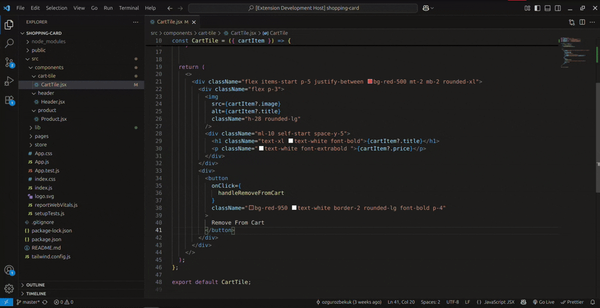

# React Select & Reuse Component

A simple yet powerful VSCode extension that helps you extract selected JSX code into a reusable component with just one keyboard shortcut.

## ✨ Features

- Quickly create reusable React components from selected JSX.
- Automatically wraps classes with a `cn()` utility for conditional class merging.
- Saves the component in a predefined folder (`src/reuseComponents`) and maintains a clean structure.
- Ensures the `cn` utility is available in `src/lib/utils.js`.
- Uses `React.forwardRef` and supports `className`, `children`, and additional props out of the box.

---

## ⚡ How to Use

1. **Select JSX code** you want to extract into a component.
2. Press `Ctrl + Alt + C` (Windows/Linux) or `⌃ + ⌥ + C` (macOS).
3. Enter the **component name** (e.g., `MyButton`).
4. Done! A new file is created under `src/reuseComponents/` with a fully functional, reusable component.

> ✅ You can use this feature inside any `.jsx` or `.tsx` file.

---

## 📸 Demo

  
*A quick demo of selecting JSX and creating a component instantly.*

---

## 🧠 How It Works

- If selected JSX includes a `className` or `class` attribute, the extension wraps them using the `cn` function.
- It checks for the presence of the `src/lib/utils.js` file and automatically creates it if it doesn’t exist.
- The generated component is wrapped in `React.forwardRef` and includes support for:
  - `className` merging
  - `children` rendering
  - Other props via `{...props}`

---

## 📁 Example Output

Suppose you select the following JSX:

```jsx
<button className="bg-blue-500 text-white px-4 py-2 rounded">Click me</button>

```

Select your component code in your JSX file, press the shortcut (ctrl + alt + c), and name your component:

**Example Component Name:** `PrimaryButton`

The extension will generate:

```jsx
// src/reuseComponents/PrimaryButton.jsx

import React from 'react';
import { cn } from '../lib/utils';

const PrimaryButton = React.forwardRef(({ className, children, ...props }, ref) => {
  return (
    <button ref={ref} className={cn("bg-blue-500 text-white px-4 py-2 rounded", className)} {...props}>
      {children}
    </button>
  );
});

PrimaryButton.displayName = 'PrimaryButton';

export default PrimaryButton;

```
### 🛠 Requirements

- React project structure with a `src/` directory  
- JavaScript or TypeScript support in VSCode  

### 🔑 Keyboard Shortcut

- Windows/Linux: `Ctrl + Alt + C`  
- macOS: `⌃ + ⌥ + C`  

### 📥 Installation

Search for **React-select-reuse-component** on the VSCode Marketplace  
or install it directly from the Extensions panel in VSCode.

### 📄 License

MIT License — see the LICENSE file.

### 🙌 Contributing

Issues and PRs are welcome!  
If you'd like to improve the className parsing or add support for TypeScript components — feel free to open a pull request.

### 🔗 Author

Developed with ❤️ by Ozgur Ozbek


